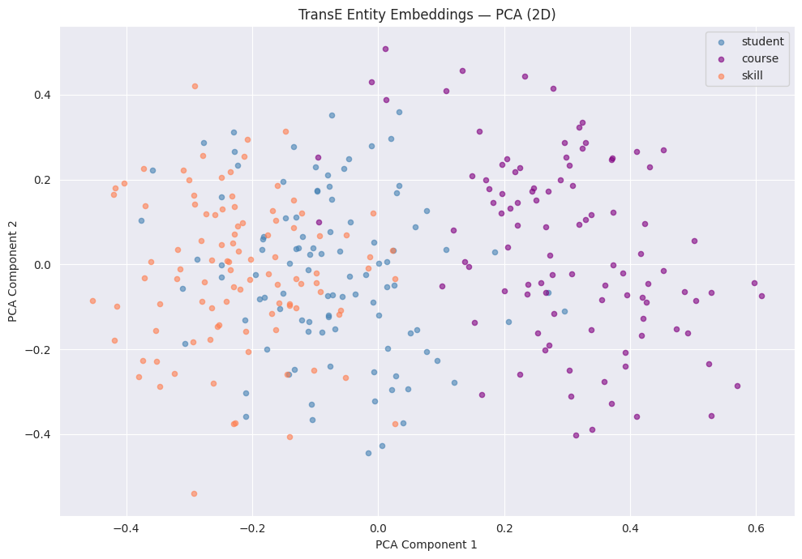
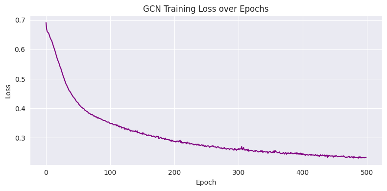

# Hybrid Knowledge Graph Course Recommendation
 
## Problem
 
Online learning platforms offer thousands of courses but their recommendation systems rely on simple co-enrollment statistics — "students who took A also took B." This misses the actual semantic structure: a Python course is related to a Data Analysis course because Python *teaches skills* that Data Analysis *requires*. Traditional systems cannot capture this.
 
## Solution
 
I built a **Knowledge Graph** that makes these relationships explicit — connecting students, courses, skills and categories as a network of 22,000 structured facts. I then applied two complementary ML techniques:
 
- **TransE** (PyKEEN) — converts every entity into a vector so that `student + enrolled_in ≈ course`, enabling link prediction for course recommendations
- **GCN** (PyTorch Geometric) — uses the graph structure itself to refine representations, initialised with TransE embeddings as node features (the *hybrid* part)
Together they produce ranked course recommendations that reflect the actual knowledge structure — not just surface-level patterns.
 
---
 
## Results
 
| Model | Metric | Value |
|---|---|---|
| TransE | Hits@10 | 0.0964 |
| TransE | MRR | 0.0525 |
| GCN | Accuracy | 82.78% |
 
## How to Run
 
1. Open `Knowledge_Graph_Finalproject.ipynb` in Google Colab
2. Upload `Online_Courses.csv` and `Students_Performance_Dataset.csv` to Google Drive
3. Run Cell 0 first — installs all libraries
4. Run all cells top to bottom
## Stack
PyKEEN · PyTorch Geometric · pandas · scikit-learn · matplotlib
 
## Visualisations

 
---

 
